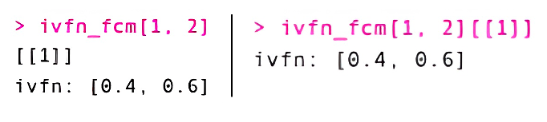

# fcmconfr

``` r

library(fcmconfr)
```

## The `fcmconfr` Workflow

`fcmconfr` streamlines the process of performing a variety of analyses
using fuzzy cognitive maps (FCMs). This package can (1) analyze
different types of FCMs (conventional, interval-value fuzzy number, and
triangular fuzzy number), (2) perform dynamic simulations on one or more
individual FCMs, (3) aggregate individual FCMs so that dynamic
simulations can be performed on the aggregate, and (4) estimate
uncertainty using Monte Carlo approaches.

A typical fcmconfr workflow includes the following four steps:

1.  Import FCMs

2.  Set simulation parameters using
    [`fcmconfr_gui()`](https://bhroston.github.io/fcmconfr/reference/fcmconfr_gui.md)

3.  Run simulations using
    [`fcmconfr()`](https://bhroston.github.io/fcmconfr/reference/fcmconfr.md)

4.  Explore outputs using
    [`get_fcmconfr_inferences()`](https://bhroston.github.io/fcmconfr/reference/get_fcmconfr_inferences.md)
    , [`summary()`](https://rdrr.io/r/base/summary.html), and
    [`plot()`](https://rdrr.io/r/graphics/plot.default.html)

This guide walks through each of these steps, from data import to
visualization. It frequently references data from the `sample_fcms`
object that users can access by loading the `fcmconfr` package.

### 1. Import FCMs

`fcmconfr` can handle three different types of FCMs: (1) conventional,
where each edge weight is represented using numeric values, (2)
interval-value fuzzy number FCMs (IVFN-FCMs), where each edge weight is
represented using two numeric values (lower bound, upper bound; i.e., an
IVFN), and (3) triangular fuzzy number FCMs (TFN-FCMs), where each edge
weight is represented using three numeric values (lower bound, mode,
upper bound; i.e., a TFN).

*A detailed guide for importing each FCM type in a manner compatible
with `fcmconfr` has been provided in a separate, companion vignette
(Importing_FCMs; run
[`vignette("Importing_FCMs", package = 'fcmconfr')`](https://bhroston.github.io/fcmconfr/articles/Importing_FCMs.md)
to view). A brief description of the typical workflow used to import
each FCM type has been provided below.*

#### 1.1 Importing Conventional FCMs

Conventional FCMs can be imported as adjacency matrices, either from
excel or csv files using standard import functions (e.g., calls to
`readxl::read_excel()` or
[`read.csv()`](https://rdrr.io/r/utils/read.table.html)). Users who plan
to use `fcmconfr` to analyze multiple FCMs together should group them
into a single `list` object.

``` r

# Import Conventional FCMs into the Global Environment
fcm_1 <- readxl::read_excel(fcm_1_filepath)
fcm_2 <- readxl::read_excel(fcm_2_filepath)
...
fcm_n <- readxl::read_excel(fcm_n_filepath)

# Group them together in a single list object
fcms <- list(fcm_1, fcm_2, ..., fcm_n)
```

#### 1.2 Importing IVFN FCMs

IVFN-FCMs have interval edge weights with lower and upper bounds, so
separate adjacency matrices must be created and uploaded for each bound
(lower and upper). Use the function
[`make_adj_matrix_w_ivfns()`](https://bhroston.github.io/fcmconfr/reference/make_adj_matrix_w_ivfns.md)
to combine the two, creating a single adjacency matrix with interval
edge weights. As noted previously for conventional FCMs, users who plan
to analyze multiple IVFN FCMs together should group them into a single
list object.

``` r

# Import separate adjacency matrices representing the 
# lower and upper bounds of each edge weight
ivfn_fcm_1_lower_adj_matrix <- readxl::read_excel(ivfn_fcm_1_lower_adj_matrix_filepath)
ivfn_fcm_1_upper_adj_matrix <- readxl::read_excel(ivfn_fcm_1_upper_adj_matrix_filepath)

# Combine the lower and upper adjacency matrices to make an IVFN FCM
ivfn_fcm_1 <- make_adj_matrix_w_ivfns(
  ivfn_fcm_1_lower_adj_matrix, ivfn_fcm_1_upper_adj_matrix
)

# Group multiple IVFN-FCMs together in a single list object
ivfn_fcms <- list(ivfn_fcm_1, ivfn_fcm_2, ..., ivfn_fcm_n)
```

#### 1.3 Importing TFN FCMs

The workflow for importing TFN FCMs is comparable to the workflow for
IVFN FCMs. The main differences are (1) the need to upload three
adjacency matrices rather than two (one for the lower bound, one for the
mode, and one for the upper bound) and (2) the function call to combine
these matrices, which is
[`make_adj_matrix_w_tfns()`](https://bhroston.github.io/fcmconfr/reference/make_adj_matrix_w_tfns.md)
rather than
[`make_adj_matrix_w_ivfns()`](https://bhroston.github.io/fcmconfr/reference/make_adj_matrix_w_ivfns.md)).
Users who plan to analyze multiple TFN-FCMs together should group them
into a single `list` object.

``` r

# Import separate adjacency matrices representing the 
# lower and upper bounds as well as the mode  of each edge weight
ivfn_fcm_1_lower_adj_matrix <- readxl::read_excel(ivfn_fcm_1_lower_adj_matrix_filepath)
ivfn_fcm_1_mode_adj_matrix <- readxl::read_excel(ivfn_fcm_1_mode_adj_matrix_filepath)
ivfn_fcm_1_upper_adj_matrix <- readxl::read_excel(ivfn_fcm_1_upper_adj_matrix_filepath)

# Combine the lower and upper adjacency matrices to make a TFN-FCM
tfn_fcm_1 <- make_adj_matrix_w_tfns(
  tfn_fcm_1_lower_adj_matrix, tfn_fcm_1_mode_adj_matrix, tfn_fcm_1_upper_adj_matrix
)

# Group multiple TFN-FCMs together in a single list object
tfn_fcms <- list(tfn_fcm_1, tfn_fcm_2, ..., tfn_fcm_n)
```

#### 1.4 Interacting with IVFN and TFN Adjacency Matrix Elements

Users can make IVFN or TFN adjacency matrices by importing matrices from
files, so they will rarely need to create an IVFN or TFN matrix from
scratch. However, the example below illustrates how `fcmconfr` creates
such objects. The example we provide below is for an IVFN matrix. The
approach for a TFN matrix is similar, but uses three- rather than
two-element lists.

``` r

# First, create a dataframe from a n x n matrix of lists
ivfn_fcm <- data.frame(matrix(data = list(), nrow = 2, ncol = 2))

# Then, place the ivfn/tfn within a list and define its location indices
# Note that since ivfn_df is a matrix of lists, we define the new 
# ivfn object as the first element of the list at index [1, 2], hence the
# need for [[1]] at the end.
ivfn_fcm[1, 1][[1]] <- list(ivfn(0, 0))
ivfn_fcm[1, 2][[1]] <- list(ivfn(0.4, 0.6))
ivfn_fcm[2, 1][[1]] <- list(ivfn(0.7, 0.8))
ivfn_fcm[2, 2][[1]] <- list(ivfn(0, 0))
```


`ivfn_df` formats. The console output for `ivfn_fcm` will vary depending
on whether it is loaded as a matrix or dataframe. If loaded as a
dataframe it will print out IVFN values. If loaded as a matrix it will
print out object types (e.g., `ivfn,2`).

  

To report the IVFN of a particular edge within an IVFN matrix, call
`ivfn_fcm[row, col]`, which returns a `list` object or
`ivfn_fcm[row, col][[1]]` to return the first record in the `list`
object, the IVFN itself.



`ivfn` object organization

  

To decompose an IVFN matrix into its upper and lower bounds, we can do
the following:

``` r

lower_adj_matrix <- apply(ivfn_df, c(1, 2), function(element) element[[1]]$lower)
upper_adj_matrix <- apply(ivfn_df, c(1, 2), function(element) element[[1]]$upper)
```

#### 1.5 Viewing Imported FCMs

Users may display FCMs in RStudio’s Viewer pane using
[`fcm_view()`](https://bhroston.github.io/fcmconfr/reference/fcm_view.md),
which plots an FCM (adjacency matrix) as a `visNetwork` object. The
resulting plot is interactive. Users can manipulate node positions
(i.e. the node layout) to explore the FCM from different angles. The
function can be used with any of the three FCM types recognized by
`fcmconfr`. For IVFN and TFN-FCMs,
[`fcm_view()`](https://bhroston.github.io/fcmconfr/reference/fcm_view.md)
plots the average edge weight to simplify the node layout.

At its core,
[`fcm_view()`](https://bhroston.github.io/fcmconfr/reference/fcm_view.md)
is just a call to `visNetwork` functions. Users who have experience with
`visNetwork` should feel free to plot FCMs directly with `visNetwork`
for greater flexibility.

``` r

# Loading FCM from sample_fcms data
adj_matrix <- sample_fcms$simple_fcms$conventional_fcms[[1]]

# Show FCM in Viewer Pane
fcm_view(fcm_adj_matrix = adj_matrix)

# Store FCM visNetwork Object in a Variable
fcm_view_output <- fcm_view(fcm_adj_matrix = adj_matrix)
fcm_view_output # Shows FCM in Viewer Pane
```


visNetwork Output of fcm_view in Viewer pane. Drag nodes to rearrange
layout.

[`fcm_view()`](https://bhroston.github.io/fcmconfr/reference/fcm_view.md)
also offers more in-depth ways to interact with FCM layouts through a
GUI that can be accessed by adding `shiny = TRUE` to the function call.


The fcm_view() GUI expands the ways users can view FCM layouts from
changing node visibility to how the curves of edges are illustrated.

``` r

# Opens GUI but will not save output
fcm_view(fcm_adj_matrix = adj_matrix, shiny = TRUE)

# Opens GUI and will save output (into fcm_view_output)
fcm_view_output <- fcm_view(fcm_adj_matrix = adj_matrix, shiny = TRUE)
```

*Note: By default,
[`fcm_view()`](https://bhroston.github.io/fcmconfr/reference/fcm_view.md)
has an additional parameter, `alert_on_open` , that users can set to
`FALSE` if they want to turn off the alert pop-up.*

To open a saved output from
[`fcm_view()`](https://bhroston.github.io/fcmconfr/reference/fcm_view.md)
in the GUI, replace the `fcm_adj_matrix` parameter with
`fcm_visNetwork`. The following example shows how to reopen the GUI with
an
[`fcm_view()`](https://bhroston.github.io/fcmconfr/reference/fcm_view.md)
output:

``` r

# Opens GUI and will save output (into fcm_view_output)
fcm_view_output_1 <- fcm_view(fcm_adj_matrix = adj_matrix, shiny = TRUE)

# Reopen the GUI and save changes in a new variable
fcm_view_output_2 <- fcm_view(fcm_visNetwork = fcm_view_output_1, shiny = TRUE)
```

### 2. Set Simulation Parameters using `fcmconfr_gui()`

The primary
[`fcmconfr()`](https://bhroston.github.io/fcmconfr/reference/fcmconfr.md)
function is the central function of the package and requires specifying
many different parameters. The
[`fcmconfr_gui()`](https://bhroston.github.io/fcmconfr/reference/fcmconfr_gui.md)
function is intended to help guide users through that process.

[`fcmconfr_gui()`](https://bhroston.github.io/fcmconfr/reference/fcmconfr_gui.md)
performs two tasks: (1) it launches a Shiny app that lets users
interactively select parameters and (2) it outputs a corresponding call
to
[`fcmconfr()`](https://bhroston.github.io/fcmconfr/reference/fcmconfr.md)
that users can copy-and-paste to run in their own scripts.

No inputs are provided to
[`fcmconfr_gui()`](https://bhroston.github.io/fcmconfr/reference/fcmconfr_gui.md),
but the local environment must have an individual FCM or a `list` object
containing multiple FCMs in order for
[`fcmconfr_gui()`](https://bhroston.github.io/fcmconfr/reference/fcmconfr_gui.md)
to be used. Once
[`fcmconfr_gui()`](https://bhroston.github.io/fcmconfr/reference/fcmconfr_gui.md)
is running, select the appropriate FCMs to analyze from a dropdown menu
titled Adj. Matrix or List of Adj. Matrices.

Matrices conforming to any of the above-noted FCM types (conventional,
IVFN, or TFN) can be selected for analysis.

``` r

fcmconfr_gui()
```


A screenshot of
[`fcmconfr_gui()`](https://bhroston.github.io/fcmconfr/reference/fcmconfr_gui.md)
with an example list of FCMs selected in the dropdown menu.

The GUI interface is organized into four tabs: Data, Agg. and Monte
Carlo Options, Simulation Options, and Runtime Options, which are
described further below.

- Data: The Data tab is where the user selects the FCMs they want to
  analyze (drop-down menu titled Adj. Matrix or List of Adj. Matrices).
  It is also where they manipulate values in the Initial State (Pulse)
  Vector or Clamping Vector to identify the dynamic simulations they
  wish to explore.

  *(Note: It is common to set every value in the Initial State (Pulse)
  Vector to 1 and to set only the node(s)-of-interest to 1 in the
  Clamping Vector. In this configuration, the Initial State (Pulse)
  Vector is used to determine the network’s state at equilibrium and the
  clamping vector is used to determine the network’s state in response
  to continuous activation of one or more nodes. The difference between
  the two is a measure of the impact of those particular nodes on the
  system.)*

- Agg. and Monte Carlo Options: The Agg. and Monte Carlo Options tab is
  where the user specifies their preferences regarding FCM aggregation
  and Monte Carlo sampling. Aggregation options are only available when
  datasets contain multiple FCMs. Monte Carlo sampling is available for
  `list` objects of conventional, IVFN- and TFN-FCMs as well as
  individual IVFN-/TFN-FCMs, but not individual conventional FCMs.
  Aggregation and Monte Carlo options can be toggled off to speed up the
  simulation process.

  - Aggregation options allow the user to specify whether multiple FCMs
    should be aggregated into a single collective model so that dynamic
    simulations can be performed on the aggregate in addition to
    individual FCMs. The user can specify the aggregation method (mean
    or median) and whether zero-weighted edges should be included in the
    aggregation process. See `?aggregate_fcms()` for more information on
    aggregating FCMs outside of the primary
    [`fcmconfr()`](https://bhroston.github.io/fcmconfr/reference/fcmconfr.md)
    function.

  - Monte Carlo options allow the user to specify whether Monte Carlo
    sampling should be performed to estimate uncertainty in dynamic
    simulation outputs. If yes, the user must specify the number of FCMs
    that will be generated by Monte Carlo sampling (we recommend 1000 or
    more). Dynamic simulations will be performed on each of these FCMs,
    providing a range of inferences for each node, from which the median
    state and quantiles (25^(th), 75^(th)) will be estimated. The user
    also has the option to perform nonparametric bootstrapping to
    estimate confidence bounds about the average inference for each
    node. Confidence limits are user-specified (i.e., 95^(th)
    percentile, 90^(th) percentile, etc.).

- Simulation Options: The Simulation Options tab is where users specify
  the type of dynamic simulation to perform. This includes
  specifying (1) the activation function (Kosko, Modified-Kosko, or
  Rescale; default of Kosko), (2) the squashing function (sigmoid or
  hyperbolic tangent; default of sigmoid), (3) the squashing function’s
  key parameter, lambda (default of 1), (4) the final simulation output
  (i.e., the peak estimate for each node or its final resting state;
  default of final), (5) the maximum number of iterations to perform per
  simulation (default of 100), and (6) the minimum acceptable error
  between iterations (default of 1x10⁻⁵)

- Runtime Options: The Runtime Options tab allows the user to specify
  whether they want to use parallel processing and have a progress bar
  displayed at runtime. These options do not impact the simulation
  outputs. They do, however, influence how long
  [`fcmconfr()`](https://bhroston.github.io/fcmconfr/reference/fcmconfr.md)
  takes to run and what the user sees at runtime.

A brief summary of each parameter within the
[`fcmconfr_gui()`](https://bhroston.github.io/fcmconfr/reference/fcmconfr_gui.md)
is provided in a glossary stored in a side tab within the GUI. The side
tab can be opened by clicking the arrow symbol in the
top-right-hand-corner of the GUI.

Once parameter selection is complete, click the ‘Get Code’ button at the
bottom of the GUI to display the corresponding code for a call to
[`fcmconfr()`](https://bhroston.github.io/fcmconfr/reference/fcmconfr.md)
within the app.

The following code is an example output from
[`fcmconfr_gui()`](https://bhroston.github.io/fcmconfr/reference/fcmconfr_gui.md).

``` r

fcmconfr(
  adj_matrices = sample_fcm_list,
  # Aggregation and Monte Carlo Sampling
  agg_function = 'mean',
  num_mc_fcms = 1000,
  # Simulation
  initial_state_vector = c(1, 1, 1, 1, 1, 1, 1),
  clamping_vector = c(1, 0, 0, 0, 0, 0, 0),
  activation = 'rescale',
  squashing = 'sigmoid',
  lambda = 1,
  point_of_inference = 'final',
  max_iter = 100,
  min_error = 1e-05,
  # Inference Estimation (bootstrap)
  ci_centering_function = 'mean',
  confidence_interval = 0.95,
  num_ci_bootstraps = 1000,
  # Runtime Options
  show_progress = TRUE,
  parallel = TRUE,
  n_cores = 2,
  # Additional Options
  run_agg_calcs = TRUE,
  run_mc_calcs = TRUE,
  run_ci_calcs = TRUE,
  include_zeroes_in_sampling = FALSE,
  include_sims_in_output = FALSE
)
```

Once the call to
[`fcmconfr()`](https://bhroston.github.io/fcmconfr/reference/fcmconfr.md)
has been generated by the GUI, copy-and-paste it into another file and
define it as a variable (see example below):

``` r

fcmconfr_obj <- fcmconfr(
  adj_matrices = sample_fcm_list,
  # Aggregation and Monte Carlo Sampling
  agg_function = 'mean',
  num_mc_fcms = 1000,
  # Simulation
  initial_state_vector = c(1, 1, 1, 1, 1, 1, 1),
  clamping_vector = c(1, 0, 0, 0, 0, 0, 0),
  activation = 'rescale',
  squashing = 'sigmoid',
  lambda = 1,
  point_of_inference = 'final',
  max_iter = 100,
  min_error = 1e-05,
  # Inference Estimation (bootstrap)
  ci_centering_function = 'mean',
  confidence_interval = 0.95,
  num_ci_bootstraps = 1000,
  # Runtime Options
  show_progress = TRUE,
  parallel = TRUE,
  n_cores = 2,
  # Additional Options
  run_agg_calcs = TRUE,
  run_mc_calcs = TRUE,
  run_ci_calcs = TRUE,
  include_zeroes_in_sampling = FALSE,
  include_sims_in_output = FALSE
)
```

Click on ‘Close App’ or exit out of the shiny window to close the app.

#### Optional: Selecting an Appropriate Lambda

Lambda is set to 1 by default in `fcmconfr`. However, there is no one
“correct” value for lambda and values that work for one FCM may not work
for another. To give users a starting estimate for lambda, `fcmconfr`
provides the `estimate_lambda()` function, which implements an algorithm
developed by Koutsellis et al. (2022) -
<https://doi.org/10.1007/s12351-022-00717-x>.

`estimate_lambda()` returns the maximum lambda value that guarantees
simulation convergence (i.e. the max. usable value for lambda) given a
particular adjacency matrix and squashing function (`sigmoid` or
`tanh`).

An example call to `estimate_lambda()` has been provided below.

``` r

example_fcm <- sample_fcms$simple_fcms$conventional_fcms[[1]]
estimate_lambda(example_fcm, squashing = "sigmoid")
estimate_lambda(example_fcm, squashing = "tanh")
```

The [Koutsellis et
al. (2022)](https://doi.org/10.1007/s12351-022-00717-x) algorithm is
intended for conventional FCMs. If an IVFN-FCM or TFN-FCM is provided,
`estimate_lambda()` will create a conventional FCM by averaging the edge
weights (upper and lower for IVFN-FCMs and upper, mode, and lower for
TFN-FCMs) for use in calculating lambda.

``` r

example_ivfn_fcm <- sample_fcms$simple_fcms$ivfn_fcms[[1]]
example_tfn_fcm <- sample_fcms$simple_fcms$tfn_fcms[[1]]
estimate_lambda(example_ivfn_fcm, squashing = "sigmoid")
estimate_lambda(example_tfn_fcm, squashing = "sigmoid")
```

Since `estimate_lambda()` returns a different value for each adjacency
matrix, users will want to identify a value that will work well with all
FCMs being analyzed in each call to
[`fcmconfr()`](https://bhroston.github.io/fcmconfr/reference/fcmconfr.md).
Given this, we recommend estimating lambda separately for each adjacency
matrix and using the minimum lambda value in
[`fcmconfr()`](https://bhroston.github.io/fcmconfr/reference/fcmconfr.md).
See example below:

``` r

# Estimating lambda for dynamic simulations with multiple FCMs
example_fcms <- sample_fcms$simple_fcms$conventional_fcms

# Call lapply() to use estimate_lambda() on a list of FCMs.
lambda_estimates <- lapply(
  example_fcms, function(fcm) estimate_lambda(fcm, squashing = "sigmoid")
)

# Unlist the output lambda estimates to create a vector
# and calculate the minimum value
lambda_for_example_fcms <- min(unlist(lambda_estimates))

# Call fcmconfr using the estimated lambda value
fcmconfr_obj <- fcmconfr(
  adj_matrices = example_fcms,
  # Aggregation and Monte Carlo Sampling
  agg_function = 'mean',
  num_mc_fcms = 1000,
  # Simulation
  initial_state_vector = c(1, 1, 1, 1, 1, 1, 1),
  clamping_vector = c(1, 0, 0, 0, 0, 0, 0),
  activation = 'rescale',
  squashing = 'sigmoid',
  lambda = lambda_for_example_fcms, # Pass lambda estimate into fcmconfr() !!!!!
  point_of_inference = 'final',
  max_iter = 100,
  min_error = 1e-05,
  # Inference Estimation (bootstrap)
  ci_centering_function = 'mean',
  confidence_interval = 0.95,
  num_ci_bootstraps = 1000,
  # Runtime Options
  show_progress = TRUE,
  parallel = TRUE,
  n_cores = 2,
  # Additional Options
  run_agg_calcs = TRUE,
  run_mc_calcs = TRUE,
  run_ci_calcs = TRUE,
  include_zeroes_in_sampling = FALSE,
  include_sims_in_output = FALSE
)
```

Note: Because `estimate_lambda()` returns a potential lambda value, not
an optimal lambda value, users are encouraged to compare the impact of
different lambda choices on their simulation results (e.g. lambda = 1,
lambda = 0.1, lambda = 0.01, …).

### 3. Run `fcmconfr()`

To run
[`fcmconfr()`](https://bhroston.github.io/fcmconfr/reference/fcmconfr.md),
execute the output script created by
[`fcmconfr_gui()`](https://bhroston.github.io/fcmconfr/reference/fcmconfr_gui.md).

Note: When using parallel processing, the following error can occur:
`Error in serialize(data, node$con) : error writing to connection`. If
this error occurs, restart the R session and rerun
[`fcmconfr()`](https://bhroston.github.io/fcmconfr/reference/fcmconfr.md)
with a lower value of `n_cores`.

### 4. Explore `fcmconfr()` Results

The output of
[`fcmconfr()`](https://bhroston.github.io/fcmconfr/reference/fcmconfr.md)
is a large object with many compomnents. Given this, the `fcmconfr`
package includes several functions designed to help users identify and
explore important outputs.

The figure below graphically represents the organization of an
[`fcmconfr()`](https://bhroston.github.io/fcmconfr/reference/fcmconfr.md)
object. Each branch represents a `list` that can be accessed via
`fcmconfr_obj$...`.


A tree illustrating the organization of an
[`fcmconfr()`](https://bhroston.github.io/fcmconfr/reference/fcmconfr.md)
output object. Three dots indicate additional data within a branch.

*Note: The aggregate and Monte Carlo elements illustrated above will
only be included in
[`fcmconfr()`](https://bhroston.github.io/fcmconfr/reference/fcmconfr.md)
objects if `run_agg_calcs`, `run_mc_calcs`, `run_ci_calcs`, and
`include_sims_in_output` are set to `TRUE` respectively in the original
[`fcmconfr()`](https://bhroston.github.io/fcmconfr/reference/fcmconfr.md)
call.*

#### 4.1 Visualizing `fcmconfr()` Results

A plot of all inferences included in the output of
[`fcmconfr()`](https://bhroston.github.io/fcmconfr/reference/fcmconfr.md)
can be generated using the command `plot(fcmconfr_obj)`.

To view documentation for the version of
[`plot()`](https://rdrr.io/r/graphics/plot.default.html) used by
`fcmconfr` output objects, type
[`?plot.fcmconfr`](https://bhroston.github.io/fcmconfr/reference/plot.fcmconfr.md)
into the console. This provides definitions for all possible inputs
(i.e., beyond the `fcmconfr` object itself) that can be used to
customize the figure.

An example call illustrating the defaults for each input has been
provided below:

``` r

# Plot Defaults
plot(fcmconfr_obj,
     interactive = FALSE, # Set to TRUE to open shiny app
     # Plot Formatting Parameters
     filter_limit = 1e-4,
     xlim = NA, # Axes limits - accepts c(lower_limit, upper_limit) inputs
     coord_flip = FALSE,
     # Plot Aesthetic Parameters
     mc_avg_and_CIs_color = "blue",
     mc_inferences_color = "blue",
     mc_inferences_alpha = 0.1, # scale from 0:transparent to 1:opaque
     mc_inferences_shape = 3, # R PCH point shape value (vertical cross)
     ind_inferences_color = "black",
     ind_inferences_alpha = 1, # scale from 0:transparent to 1:opaque
     ind_inferences_shape = 16, # R PCH point shape value (small circle)
     agg_inferences_color = "red",
     agg_inferences_alpha = 1, # scale from 0:transparent to 1:opaque
     agg_inferences_shape = 17, # R PCH point shape value (triangle)
     ind_ivfn_and_tfn_linewidth = 0.1,
     agg_ivfn_and_tfn_linewidth = 0.6
)
```

The `interactive` parameter in the call to
[`plot()`](https://rdrr.io/r/graphics/plot.default.html) allows users to
launch the plot inside a Shiny app where the results from different
analyses can be toggled on/off (`interactive = TRUE`). This is a great
option for data exploration. *Note:* *It may be necessary to experiment
with font size within the app to clearly view axis labels*.

An example call, where the `interactive` parameter is set to `TRUE` and
the x-axis is constrained between -0.5 and 0.5 has been provided below:

``` r

plot(fcmconfr_obj,
     interactive = TRUE,
     xlim = c(-0.5, 0.5))
```


A screenshot of an example
[`fcmconfr()`](https://bhroston.github.io/fcmconfr/reference/fcmconfr.md)
object launched inside the Shiny app (user controls on left; plot on
right).

#### 4.2 Retrieving Inferences with get_fcmconfr_inferences()

Simulation inferences (individual, aggregate, Monte Carlo) are the main
output from
[`fcmconfr()`](https://bhroston.github.io/fcmconfr/reference/fcmconfr.md).
They indicate how much each node is influenced by a particular change or
action. Inferences can be accessed as follows:

``` r

all_inferences <- fcmconfr_obj$inferences

individual_fcm_inferences <- all_inferences$individual_fcms$inferences
aggregate_fcm_inferences <- all_inferences$aggregate_fcm$inferences
mc_fcm_inferences <- all_inferences$monte_carlo_fcms$all_inferences
CIs_of_avg_mc_fcm_inferences <- all_inferences$monte_carlo_fcms$bootstrap$CIs_and_quantiles_by_node
```

In addition to accessing inference data manually (as shown above),
`fcmconfr` provides the
[`get_fcmconfr_inferences()`](https://bhroston.github.io/fcmconfr/reference/get_fcmconfr_inferences.md)
function to retrieve and store inference results.

``` r

fcmconfr_inferences <- get_fcmconfr_inferences(fcmconfr_obj, analysis = c("individual", "aggregate", "mc"))
```

The output of
[`get_fcmconfr_inferences()`](https://bhroston.github.io/fcmconfr/reference/get_fcmconfr_inferences.md)
is a `list` of dataframes containing the inferences for each analysis.
By default, `analysis = c("individual", "aggregate", "mc")`, but users
can also specify a subset of these categories.

When `"mc"` is included and the box for bootstrapped confidence
intervals is checked,
[`get_fcmconfr_inferences()`](https://bhroston.github.io/fcmconfr/reference/get_fcmconfr_inferences.md)
returns two types of MC outputs: (1) inferences from each empirical FCM
generated by Monte Carlo sampling and (2) a dataframe containing user
specified bootstrapped confidence bounds about the average of those
inferences.

#### 4.3 Retrieving Inferences with summary()

Users can also access a simplified output of
[`fcmconfr()`](https://bhroston.github.io/fcmconfr/reference/fcmconfr.md)
inferences using the [`summary()`](https://rdrr.io/r/base/summary.html)
function on an
[`fcmconfr()`](https://bhroston.github.io/fcmconfr/reference/fcmconfr.md)
output object.

``` r

summary(fcmconfr_obj)
```

[`summary()`](https://rdrr.io/r/base/summary.html) also prints
information about the inferences across each analysis performed to
create the
[`fcmconfr()`](https://bhroston.github.io/fcmconfr/reference/fcmconfr.md)
output. An example of a `summary(fcmconfr_obj)` output for an analysis
of IVFN-FCMs that only calculated inferences for the individual and
aggregate adjacency matrices is given below:

    ~~~~~ Summary ~~~~~

    $individual_inferences
                                                                 Median                   Mean
    Guidance.Docs.for.Salt.Management                           1, 1, 1                1, 1, 1
    Public.Education.Programs                                   0, 0, 0    0.002, 0.007, 0.011
    Salts.Added.during.Water.Treatment                          0, 0, 0                0, 0, 0
    Salts.Added.by.Winter.Maintenance.Activities  -0.250, -0.097, 0.000 -0.175, -0.118, -0.043
    Ecosystem.Health                                0.012, 0.064, 0.088    0.034, 0.071, 0.092
    Public.Awareness.of.Reservoir.Salinization                  0, 0, 0   -0.001, 0.000, 0.000
    Salinization.of.the.Reservoir                -0.139, -0.092, -0.012 -0.144, -0.100, -0.038

    $aggregate_inferences
                                                  crisp  lower   mode  upper
    Guidance.Docs.for.Salt.Management             1.000  1.000  1.000  1.000
    Public.Education.Programs                     0.008  0.002  0.008  0.015
    Salts.Added.during.Water.Treatment            0.000  0.000  0.000  0.000
    Salts.Added.by.Winter.Maintenance.Activities -0.131 -0.212 -0.136 -0.046
    Ecosystem.Health                              0.076  0.034  0.080  0.115
    Public.Awareness.of.Reservoir.Salinization   -0.001 -0.002 -0.001  0.000
    Salinization.of.the.Reservoir                -0.119 -0.187 -0.124 -0.045

    ┌────────────────────────────────────────────────────────────────┐
    │                                                                │
    │   Inferences via fcmconfr: 30 individual adj. matrices (tfn)   │
    │                                                                │
    └────────────────────────────────────────────────────────────────┘

##### Advanced Inference Options

FCM inferences are calculated from FCM simulations, which can include
hundreds of iterations for each node in each FCM (individual, aggregate,
and Monte Carlo).

The
[`get_fcmconfr_inferences()`](https://bhroston.github.io/fcmconfr/reference/get_fcmconfr_inferences.md)
function returns standard inference estimates only (e.g., the final
point of convergence for each node or the peak simulated value for each
node, as specified in the original call to
[`fcmconfr()`](https://bhroston.github.io/fcmconfr/reference/fcmconfr.md))

Users interested in calculating their own inferences directly from
simulation time-series can access that data as follows:

``` r

# Simulations for individual_fcms
individual_fcms_sims <- fcmconfr_obj$inferences$individual_fcms$simulations

# Simulations for aggregate_fcm
aggregate_fcm_sims <- fcmconfr_obj$inferences$aggregate_fcm$simulations

# Simulations for monte_carlo_fcms
monte_carlo_fcms_sims <- fcmconfr_obj$inferences$monte_carlo_fcms$simulations
```

These commands return a `list` of the simulations for every adjacency
matrix in a given analysis. Users can retrieve simulations for a
specific adjacency matrix (e.g., `adj_matrix_1` from
`individual_fcms_sims`) as follows:

``` r

sim_1 <- individual_fcms_sims$adj_matrix_1$simulations
```

This returns both the `scenario_simulation` and `baseline_simulation`
data for a given adjacency matrix.

The `scenario_simulation` outputs incorporate the clamping vector, so we
observe the influence of continuously activating (“clamping”) one (or
some) nodes.

The `baseline_simulation` outputs incorporate ONLY the initial state
vector, so we observe the steady-state (or natural behavior) of the
system as a control.

Inferences are calculated by taking the difference between the two
(`scenario - baseline`). Different metrics are used for `peak` vs
`final` inferences as described below:

``` r

# Continuing from the example above

# Get the state vectors for the scenario simulation
scenario_state_vectors <- sim_1$scenario_simulation$state_vectors

# Get the state vectors for the baseline simulation
baseline_state_vectors <- sim_1$baseline_simulation$state_vectors

# Calculating final inferences
# Same as fcmconfr() output with point_of_inference = 'final'
scenario_sim_final_values <- scenario_state_vectors[nrow(scenario_state_vectors), ]
baseline_sim_final_values <- baseline_state_vectors[nrow(baseline_state_vectors), ]

individual_fcm_1_final_inferences <- scenario_sim_final_values - baseline_sim_final_values

# Calculating peak inferences
# Same as fcmconfr() output with point_of_inference = 'peak'
# Note: Peak will not work unless all values in the clamping vector are 0!
scenario_sim_peak_values <- t(apply(
  scenario_state_vectors, 2, function(col) {unique(col[abs(col) == max(abs(col))])}
))
baseline_sim_peak_values <- t(apply(
  baseline_state_vectors, 2, function(col) {unique(col[abs(col) == max(abs(col))])}
))

individual_fcm_1_peak_inferences <- scenario_sim_peak_values - baseline_sim_peak_values
```

Users can view `scenario` and `baseline` simulation time-series for
specific nodes (e.g., `Salinization.of.the.Reservoir`) as described
below. The difference between the `scenario` and `baseline` time-series
is the inference.

``` r

salinization_scenario_time_series <- scenario_state_vectors$Salinization.of.the.Reservoir
salinization_baseline_time_series <- baseline_state_vectors$Salinization.of.the.Reservoir

plot(salinization_scenario_time_series, type = "l",
      xlab = "Iteration", ylab = "Activation Level")
lines(salinization_baseline_time_series, lty = "dashed")
legend(x = "topright",          
       legend = c("Baseline", "Scenario"),  
       lty = c(1, 2),         
       lwd = 2)   
```


Scenario and Baseline time-series data for Salinization.of.the.Reservoir
based on the first of the individual FCMs
