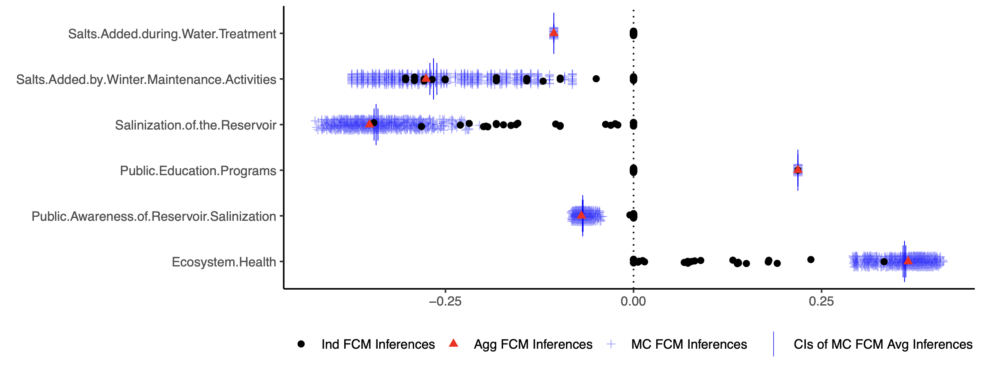

# fcmconfr

------------------------------------------------------------------------

`fcmconfr` (pronounced “FCM Confer”) streamlines the process of
conducting dynamic simulations using Fuzzy Cognitive Maps (FCMs). The
package supports multiple FCM types (conventional, Interval-Value Fuzzy
Number (IVFN) and Triangular Fuzzy Number (TFN)) and provides tools for
model aggregation and the propagation of uncertainty from individual
FCMs through to the aggregate.

`fcmconfr` includes a variety of supporting functions that make working
with FCMs easier, including functions for creating IVFN and TFN
adjacency matrices from standard .xlsx and .csv files, functions for
stramlining parameter selection to facilitate model convergence, and
functions for visualizing FCM networks and simulation outputs. The
package was developed with a strong focus on accessibility (ease-of-use)
and features both an interactive GUI and standard function commands.

## Installation

Users can install the development version of `fcmconfr` from
[GitHub](https://github.com/) with:

``` r

# install.packages("pak")
pak::pak("bhroston/fcmconfr")
# Or
remotes::install_github("bhroston/fcmconfr")
```

Note: `fcmconfr` requires the following packages for GUI-based
functions: visNetwork, shiny, shinyWidgets, bslib.

## Example

A typical `fcmconfr` workflow includes the following four steps:

1.  Import FCMs

2.  Set simulation parameters using
    [`fcmconfr_gui()`](https://bhroston.github.io/fcmconfr/reference/fcmconfr_gui.md)

3.  Run simulations using
    [`fcmconfr()`](https://bhroston.github.io/fcmconfr/reference/fcmconfr.md)

4.  Explore outputs using `get_inferences()` and
    [`plot()`](https://rdrr.io/r/graphics/plot.default.html)

See
[`vignette("fcmconfr", package = "fcmconfr")`](https://bhroston.github.io/fcmconfr/articles/fcmconfr.md)
for a detailed description of each step.

### 1. Import FCMs

FCMs are matrix objects that can be imported into R using
`readxl::read_excel()` and
[`read.csv()`](https://rdrr.io/r/utils/read.table.html). The best
approach for importing an FCM into R depends on the type of FCM being
imported.

See
[`vignette("Importing_FCMs", package = "fcmconfr")`](https://bhroston.github.io/fcmconfr/articles/Importing_FCMs.md)
for a detailed guide on importing different FCM types, including
conventional FCMs, FCMs with edge weights represented as IVFNs
(IVFN-FCMs), and FCMs with edge weights represented as TFNs (TFN-FCMs).

### 2. Set Simulation Parameters using `fcmconfr_gui()`

[`fcmconfr()`](https://bhroston.github.io/fcmconfr/reference/fcmconfr.md)
is the central function of the package and requires specifying many
parameters. To guide users through that process, the package procides an
easy to use GUI that can be accessed by
[`fcmconfr_gui()`](https://bhroston.github.io/fcmconfr/reference/fcmconfr_gui.md).


[`fcmconfr_gui()`](https://bhroston.github.io/fcmconfr/reference/fcmconfr_gui.md)
Screenshot

Calling
[`fcmconfr_gui()`](https://bhroston.github.io/fcmconfr/reference/fcmconfr_gui.md)
launches a Shiny app that lets users interactively select parameters and
outputs a corresponding call to
[`fcmconfr()`](https://bhroston.github.io/fcmconfr/reference/fcmconfr.md)
that users can copy-and-paste to run in their own scripts.

A brief summary of each parameter within the
[`fcmconfr_gui()`](https://bhroston.github.io/fcmconfr/reference/fcmconfr_gui.md)
is provided in a glossary stored in a side tab within the GUI. The side
tab can be opened by clicking the arrow symbol in the
top-right-hand-corner of the GUI.

### 3. Run Simulations using `fcmconfr()`

To run
[`fcmconfr()`](https://bhroston.github.io/fcmconfr/reference/fcmconfr.md),
execute the output script created by \`fcmconfr_gui(). The following
call uses an example FCM from the `sample_fcms` data included in the
package.

``` r

# This call to fcmconfr() was generated from fcmconfr_gui()!
# Store the output in a variable to explore it later
fcmconfr_obj <- fcmconfr(
    adj_matrices = sample_fcms$simple_fcms$conventional_fcms,
    # Aggregation and Monte Carlo Sampling
    agg_function = 'mean',
    num_mc_fcms = 1000,
    # Simulation
    initial_state_vector = c(1, 1, 1, 1, 1, 1, 1),
    clamping_vector = c(1, 0, 0, 0, 0, 0, 0),
    activation = 'rescale',
    squashing = 'sigmoid',
    lambda = 1,
    point_of_inference = 'final',
    max_iter = 100,
    min_error = 1e-05,
    # Inference Estimation (bootstrap)
    ci_centering_function = 'mean',
    confidence_interval = 0.95,
    num_ci_bootstraps = 1000,
    # Runtime Options
    show_progress = TRUE,
    parallel = TRUE,
    n_cores = 2,
    # Additional Options
    run_agg_calcs = TRUE,
    run_mc_calcs = TRUE,
    run_ci_calcs = TRUE,
    include_zeroes_in_sampling = FALSE,
    include_sims_in_output = FALSE
  )
```

### 4. Explore `fcmconfr()` Results

[`fcmconfr()`](https://bhroston.github.io/fcmconfr/reference/fcmconfr.md)
generates a large object with many concepts, the most important of which
are simulation inferences (individual, aggregate, Monte Carlo).
Inferences indicate how much each node in an FCM is influenced by a
particular change or action. The `get_inferences()` function gives users
access to that data without having to interact with the
[`fcmconfr()`](https://bhroston.github.io/fcmconfr/reference/fcmconfr.md)
object directly.

``` r

fcmconfr_inferences <- get_inferences(fcmconfr_obj)
```

A plot of all inferences can be generated using
[`plot()`](https://rdrr.io/r/graphics/plot.default.html). Documentation
for [`plot()`](https://rdrr.io/r/graphics/plot.default.html) can be
accessed via
[`?plot.fcmconfr`](https://bhroston.github.io/fcmconfr/reference/plot.fcmconfr.md)
([`?plot`](https://rdrr.io/r/graphics/plot.default.html) *returns the
documentation for the Base R version of the function*).

``` r

plot(fcmconfr_obj)
```



[`plot.fcmconfr()`](https://bhroston.github.io/fcmconfr/reference/plot.fcmconfr.md)
Output

## Related Packages

- [MentalModeler](https://www.mentalmodeler.com/) is a web-based
  platform to build FCMs with features for “what-if” analysis.
- [`fcm`](https://cran.r-project.org/web/packages/fcm/index.html) is an
  R package that includes functions for simulating individual
  conventional FCMs.
- [`InCognitive`](https://github.com/ThemisKoutsellis/InCognitive) is a
  Python package that for simulating conventional FCMs with lambda
  optimization and Monte Carlo analysis.
- [`FCMpy`](https://github.com/SamvelMK/FCMpy) is a Python package that
  supports translation of linguistic terms to quantitative edge weights,
  FCM simulation and genetic learning algorithms.
- [`PyFCM`](https://github.com/payamaminpour/PyFCM) is a Python package
  that includes functions for FCM simulation and aggregation.
- [`jFCM`](https://github.com/megadix/jfcm?tab=readme-ov-file) is a
  java-based suite of functions to simulate FCMs.

## Contributing

Please note that this package is released with a [Contributor Code of
Conduct](https://ropensci.org/code-of-conduct/). By contributing to this
project, you agree to abide by its terms.

- If you think you have encountered a bug, please [submit an
  issue](https://github.com/bhroston/fcmconfr/issues).

- Please include a
  [reprex](https://reprex.tidyverse.org/articles/articles/learn-reprex.html)
  (a minimal, reproducible example) to clearly communicate about your
  code.
